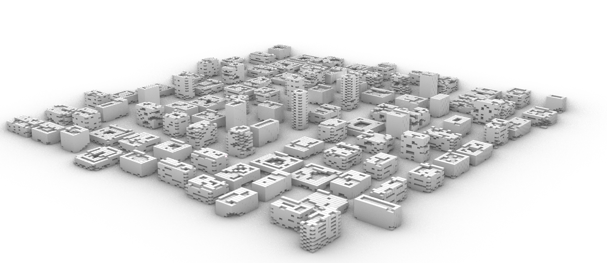

# tower-gen

Procedural voxel towers → photorealistic architecture.

Generate thousands of unique building designs using Cellular Automata, then render them with diffusion models.

**[SIGGRAPH Asia 2025 Poster]**

---



---

## How it works

```
         CA Rules                    ControlNet                  GPT-4.1
            ↓                            ↓                          ↓
┌──────────────────┐      ┌──────────────────┐      ┌──────────────────┐
│   Voxel Massing  │  →   │  Photorealistic  │  →   │   Architectural  │
│                  │      │    Rendering     │      │   Description    │
└──────────────────┘      └──────────────────┘      └──────────────────┘
```

**1. Generate** — 3D Cellular Automata creates tower forms with configurable birth/survival rules

**2. Render** — SDXL + ControlNet preserves geometry while adding materials and lighting

**3. Describe** — GPT-4.1 generates architectural descriptions for each design

---

## Results

| Metric | Value |
|--------|-------|
| Unique configurations | 15,000+ |
| Generation time | ~70 sec/model |
| Structure preservation | High (Canny edge conditioning) |

---

## Quick start

**Generate towers** (requires Rhino):
```python
# Run generate.py in Rhino Python editor
```

**Add descriptions**:
```bash
cp describe/.env.example describe/.env
# Add your OPENAI_API_KEY and STABILITY_API_KEY
python describe/analyze.py
```

---

## Structure

```
generate.py       — Rhino script, CA tower generation
describe/
  analyze.py      — GPT-4.1 image → text
  enhance.py      — Stability AI rendering
output/
  towers/         — geometry + params
  renders/        — final images
  descriptions/   — text labels
```

---

## Configuration

Edit parameters in `generate.py`:

| Parameter | Default | Description |
|-----------|---------|-------------|
| `CELL_SIZE` | 2.0 | Voxel dimensions |
| `LAYER_HEIGHT` | 3.5 | Floor-to-floor height |
| `MAX_VOXELS` | 2500 | Density limit |
| `BIRTH_OPTIONS` | [2, 3] | CA birth rules |
| `SURV_MIN/MAX` | [1,2] / [8] | CA survival range |

---

## Sample outputs


---

## Authors

Sabri Gokmen, Andrei Vince, Aidan Oh

UNC Charlotte / UNC Chapel Hill

```bibtex
@inproceedings{gokmen2025tower,
  title={A Framework for Architectural Geometry Synthesis Using Cellular Automata and Conditioned Diffusion Models},
  author={Gokmen, Sabri and Vince, Andrei and Oh, Aidan},
  booktitle={SIGGRAPH Asia 2025 Posters},
  year={2025}
}
```
